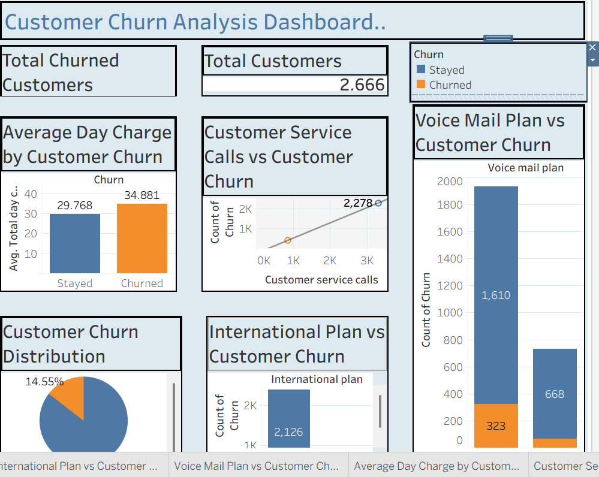

# Customer Churn Analysis

## Project Overview

This project focuses on analyzing customer churn patterns to understand the factors influencing customer retention and identify areas where businesses can improve customer loyalty.

Using Python for data analysis and Tableau for visualization, this project transforms raw customer data into meaningful insights that can support data-driven business decisions.

## Business Problem

Customer churn directly impacts business revenue and growth. The objective of this analysis was to identify key characteristics of customers who leave and uncover patterns that can help organizations develop effective retention strategies.

## Project Objectives

* Analyze customer churn trends
* Identify factors contributing to customer attrition
* Understand customer behavior patterns
* Create an interactive dashboard to communicate insights
* Provide recommendations for improving customer retention

## Tools Used

* Python (Data Cleaning, Exploratory Data Analysis, Data Analysis)
* Tableau (Dashboard Development and Data Visualization)
* Pandas
* Matplotlib
* Seaborn

## Analysis Process

### 1. Data Preparation

* Loaded and explored the customer dataset
* Checked for missing values and data quality issues
* Cleaned and prepared the data for analysis

### 2. Exploratory Data Analysis

* Analyzed customer demographics
* Examined churn distribution
* Identified relationships between customer attributes and churn behavior

### 3. Data Visualization

Created an interactive Tableau dashboard to highlight:

* Overall churn rate
* Customer segments with higher churn
* Key factors influencing customer retention

## Key Insights

* Identified patterns among customers who were more likely to churn
* Discovered important customer characteristics associated with retention
* Highlighted areas where businesses can focus their retention efforts

## Business Recommendations

* Develop targeted retention strategies for high-risk customer groups
* Improve customer engagement initiatives
* Monitor customer behavior patterns regularly
* Create personalized offers to encourage customer loyalty

## Project Files

* Dataset
* Python Analysis Notebook
* Tableau Dashboard
* Project Report

## Dashboard Preview

